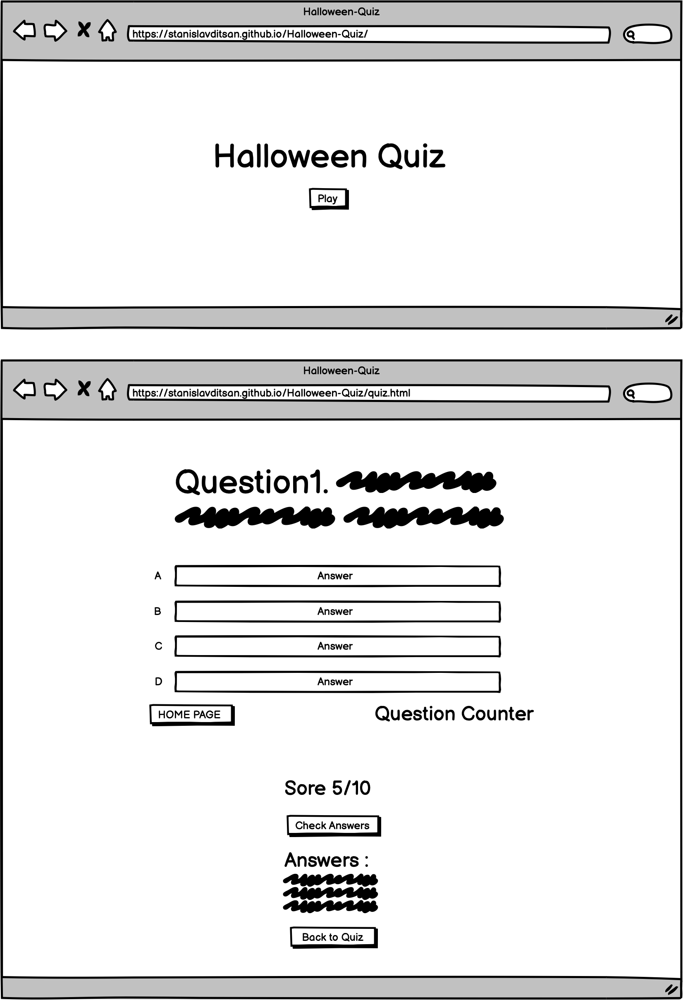
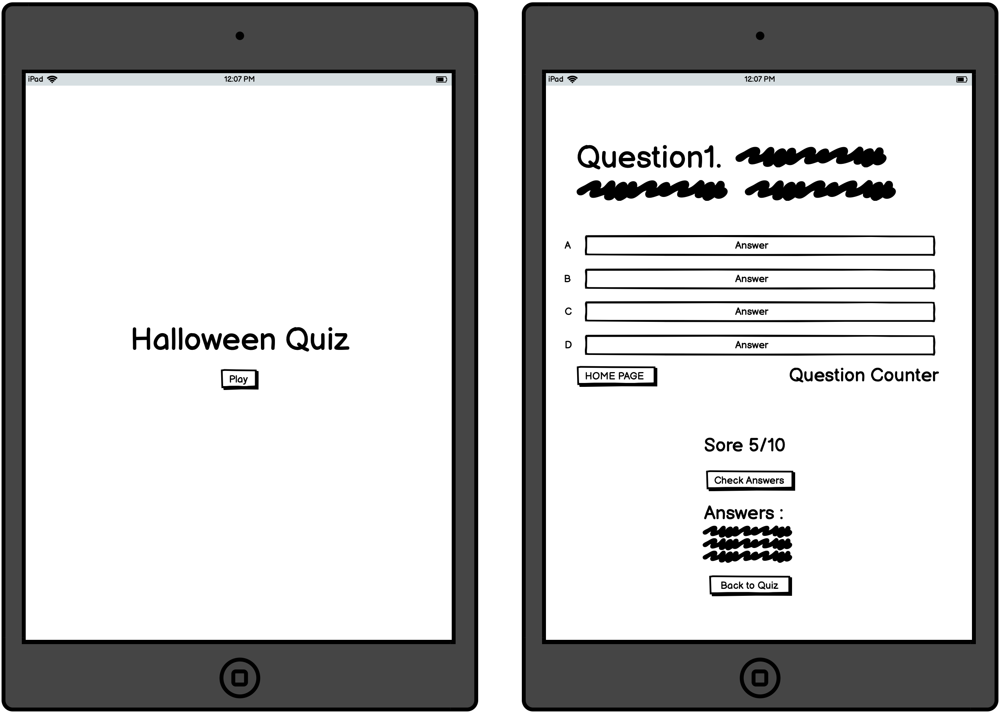
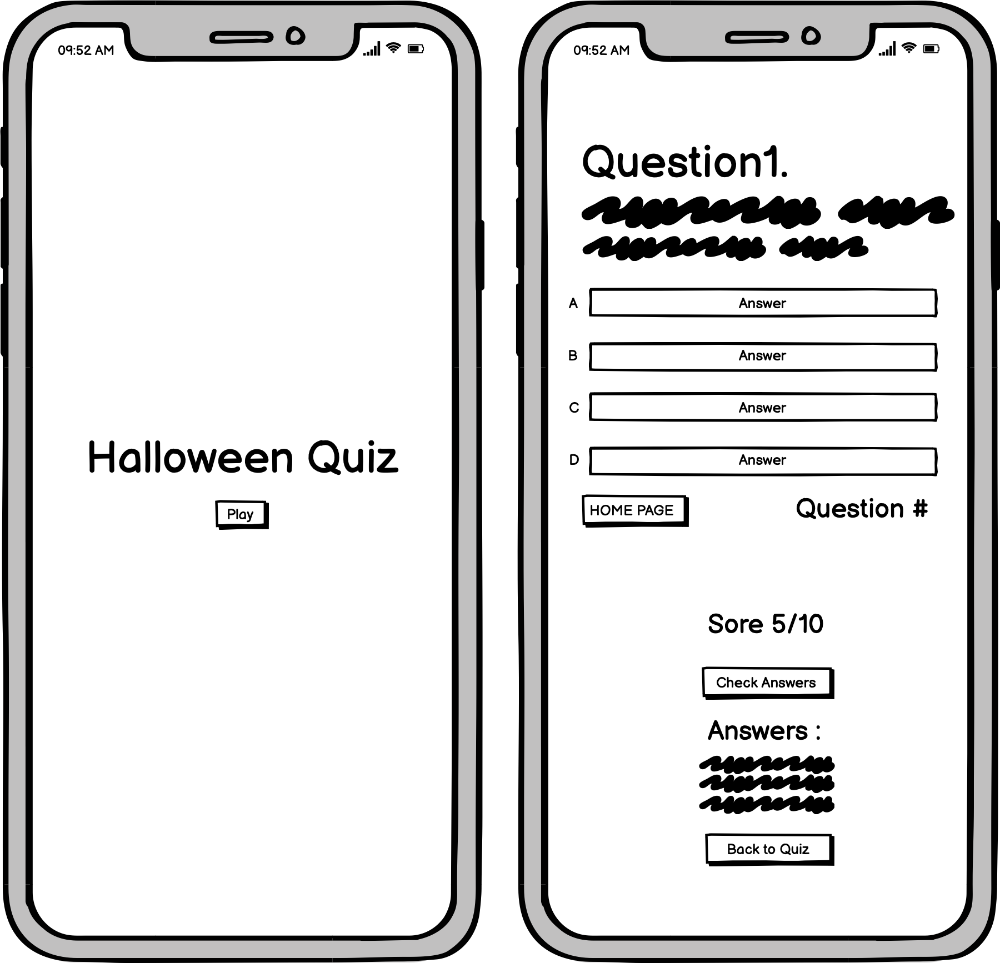
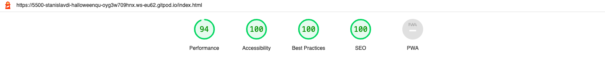
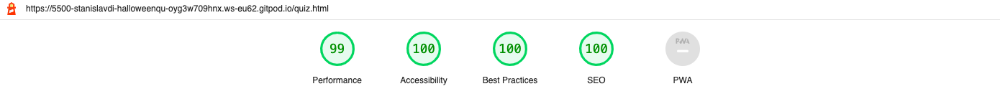
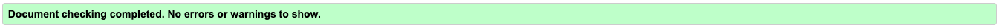
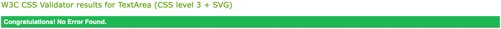
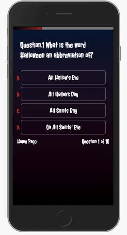

This **🎃 `Halloween` 🎃** trivia quiz will put your knowledge to the test. The quiz is intended to be enjoyable and entertaining. The quiz's features are simple to use and navigate. The rules of the quiz are simple: answer as many correct questions as possible before time runs out! 

 
#### To play **`Halloween Quiz`** click 🦇 [here](https://stanislavditsan.github.io/Halloween-Quiz/)

# Table of Content
- [User Experience](#user-experience)

  * [UX](#user-experience)

  * [Project Goal](#project-goal)

  * [User Objectives](#user-objectives)

- [Features](#features)

  * [The Home Page](#the-home-page)

  * [Quiz Page](#quiz-page)

- [Design](#design)

  * [Color Scheme](#color-scheme)

  * [Typography](#typography)

- [Wireframes](#wireframes)

  * [Desktop](#desktop)

  * [Tablet](#tablet)

  * [Mobile](#mobile)

- [Languages Used](#languages-used)

- [Technologies Used and Tools](#technologies-used-and-tools)

- [Testing](#testing)

  * [Lighthouse](#lighthouse)

  * [Code Validation](#code-validation)

  * [Browser Compatibility](#browser-compatibility)

  * [Responsiveness](#responsiveness)

- [Bugs](#bugs)  

- [Deployment](#deployment) 

- [Credits](#credits)

  * [Content](#content)

  * [Acknowledgements](#acknowledgements)

  

 
# User Experience

## As a first time visitor I am able to: 

- View an alert message with instructions.

- See the difference between selecting the correct or incorrect answer with green for correct and red for incorrect.

- View the total number of questions before and after the answer was submitted.

- View the total score after the quiz was completed.

- The ability to check the answers after completing the quiz.

- The ability to return and restart the quiz.

- The option to go back to the home page.

- Access the app from any piece of technology such as smartphone, tablet, laptop or computer and be able to view all of the original content without any loss.

# Project Goal
-  Create the quiz to be as informative and user friendly.

- Allow the user to answer the quiz questions by selecting one of four answer options before the timer runs out.

- Be able to see the total score.

- Be able to see the total number of questions.

- Be able to see the correct answers after completing the quiz.

- Be able to provide instruction information to the user.

# User Objectives

- A website that provides an easy-to-understand quiz game.

- A website with visual interaction.

- A website with a modern design.

- A website that makes it simple to find and understand quiz controls.

- A website with which I can interact on a desktop, tablet, or mobile device.

# Features

## The Home Page 

 

- I wanted a simple homepage with a Halloween vibe, so I added the spooky font. 

- I used red to create a blood-like effect, and I used bats animation to give the page some movement. 

- I added a play button to allow users to jump right into the quiz, and I believe the homepage is simple to use.

- Plugin to display the bats animation was taken from [jQueryscript](https://www.jqueryscript.net/animation/halloween-bats-flying-around.html) 

## Quiz Page

 

The quiz page was created with a clean layout, well-placed buttons with hover effects, a lovely spooky typography, and a dark gradient background.

***In the future, I intend to increase the total number of questions.***

- An alert pop-up message appears at the start of the quiz, stating ` “Complete the quiz before the timer runs out. Keep an eye on the timer bar” `

- A timer bar appears at the top of the page.

 

- The Halloween Quiz Page contains four different options for answering the questions.

- When you submit answer by simply clicking, you get a nice hover effect and a background of red and green.

 

- There is also a question counter and a home page button on the page.

 

 

- When the timer runs out, an alert pop-up message appears,
stating 
` “Time has run out! however, the quiz can still be completed” `

## Quiz page after answering all the questions 
 
- An alert pop-up message appears once all of the questions have been answered.
 ` “Congratulations, you have completed the quiz! Scroll down to see the results and answers” `

- You can see your overall score, review the answers, and return to the quiz by scrolling down once the quiz is completed .

# Design

- To achieve a Halloween vibe, I chose a spooky font. I used dark colors to tie the quiz into the Halloween theme, with red accents to represent blood.

## Why did I choose to do a Halloween Quiz?

- As one of my favorite holidays, I decided to create a Halloween quiz. It is the only dark holiday of the year. It's a lot of fun to dress up and enjoy other people's outfits. Decorating your home, or yard is enjoyable. Everything is done for fun. 

- This quiz is simply a fun extra activity to do with friends or family during Halloween.

## Color Scheme
For the project, these colors were chosen :

- `linear-gradient(to bottom, #051937, #171228, #190a1a, #12040d, #000000)` background on all pages

- ⚫️ black
- ⚪️ white
- 🔴 red
- 🟢 green

## Typography

-  [Jolly Lodger](https://fonts.google.com/specimen/Jolly+Lodger) a frightening cartoon font, created by Font Diner.

- The font is distributed under the terms of the SIL Open Font License. 

- The font is free to use for personal and commercial purposes, as well as to modify and distribute. 

- [Google Fonts](https://fonts.google.com/) also offers this web-font.

# Wireframes
 The Wireframes were created using [Balsamiq](https://balsamiq.com/wireframes/)

## Desktop 
 - Index & Quiz 

## Tablet
- Index & Quiz 

## Mobile
- Index & Quiz

# Languages Used

- [HTML](https://html.com/)
- [CSS](https://www.w3.org/Style/CSS/Overview.en.html)
- [JavaScript](https://www.javascript.com/)
 
# Technologies Used and Tools

### [Color Space](https://mycolor.space/)

- Color Space was used to create gradient background.

### [JSHint](https://jshint.com/)
- JSHint was used as a tool to detect errors and problems in JavaScript code.

### [CSS-Tricks](https://css-tricks.com/)
- CSS-Tricks was used for hover effects and as a resource.

### [ezGIF](https://ezgif.com/)
- ezGIF was used as an online GIF maker and image editor.

### [Google Fonts](https://fonts.google.com/)

- Google fonts were used to import the [Jolly Lodger](https://fonts.google.com/specimen/Jolly+Lodger), font was linked directly to all of the html pages.

### [jQuery](https://www.jqueryscript.net/)

- jQuery plugin was used to add bats animation for the home page.

### [GitPod](https://gitpod.io/)

- Gitpod was used to edit code within the project for the site and to push commitments. 

### [GitHub ](https://github.com/)

- GitHub was used to create the repository and store the project code after it has been pushed from Git.

### [Balsamiq](https://balsamiq.com/wireframes/)

-  Balsamiq was used to create the wireframes during the design phase.

### [Google Chrome](https://www.google.com/chrome/)

 - Chrome was used to debug and test the website's source code as well as to check for responsiveness.

### [Am I Responsive](https://ui.dev/amiresponsive/)

- Used to generate the live site images

### [W3C Markup Validation Service](https://validator.w3.org/)

- This service was used to check the HTML and CSS files for errors.

### [Favicon & App Icon Generator](https://www.favicon-generator.org/)

- Used to create a site favicon.

# Testing

## Lighthouse

- Lighthouse, a Chrome DevTool, is used to analyze a site for SEO, performance, accessibility.

Here are some of the results

# Code Validation

## W3C HTML Validator
- Home Page

- Quiz Page

## W3C CSS Validator

### CSS validator passed with no errors
- 

## Browser Compatibility

- The website was checked for errors using Mozilla Firefox, Safari, and Google Chrome. Across a range of device sizes and browsers, appearance, functionality, and responsiveness remained constant.

## Responsiveness
- Responsive design tests were performed using [Google Chrome DevTools](https://developer.chrome.com/docs/devtools/).

- Responsiveness was achieved by using media queries.

 - I also tested it on an iPhone 8 Plus, an iPhone 11, an iPad Pro, and a MacBook Air.
 
# Bugs

While working on this quiz project, I found some bugs. The bug consists primarily of mobile and tablet devices.

 

- The hover effect on the answer box does not return to its initial position after submission. 
- The only way to prevent this is to select the actual letter choice and after select the answer.
- Additionally, the letters A, B, C, D, are shuffled in the wrong order.

## How did I solve this problem?

- I haven't yet come up with a solution to these bugs.

# Deployment

## This project was created with the [GitPod](https://gitpod.io/) by committing to git and pushing to [GitHub ](https://github.com/).

The following procedures were used to publish this page to GitHub Pages from the specific GitHub repository:

1. The first step is to sign in to Github and navigate to the appropriate repository.

2. Click the settings button at the top of the repository.

3. Scroll down to the section GitHub Pages.

4. Select the Main branch under Source.

5. Hit Save button, and the website is now deployed.

6. The webpage's URL can be found at the top of the GitHub Pages section.

## How should this project be carried out locally?

To clone this project from GitHub, follow these steps:

1. Access the Project GitHub repository.

2. Under the repository name click on the ‘Code’ tab

3. Click the clipboard icon in the clone box's HTTPS tab.

4. Open GitBash in your IED.

5. Change your current working directory to the location where the cloned directory will be created.

6. Type "git clone" and then paste the GitHub URL.

7. Press enter and the local clone will be created.

## How to Fork the Repository?

The repository can be forked to produce a second copy that can be modified without changing the original.

1. Log in to Github and navigate to the desired repository.

2. Click "fork" at the top of the repository.

3. A copy of your github account will now be created.

# Credits

- Aung Thapya is to be thanked for the tutorial, which may be viewed at its original location at [Morioh](https://morioh.com/p/0836e90e5b19). It aided me in the development of my project.

- Some code-related issues have been resolved utilizing [Stack Overflow](https://stackoverflow.com/).

- [W3Schools](https://www.w3schools.com/) is used for problem solving.

-  The README.md was influenced by both my earlier project and a number of other students I came across.

### Content
- Some of the questions for quiz were used from [icebreakerideas](https://icebreakerideas.com/halloween-trivia/) 

## Acknowledgements

- I would like to thank [Harry Dhillon](https://github.com/Harry-Leepz), my course mentor, for his guidance and advice throughout the project.

- I also want to thank my wife for coming up with some of the questions that are Halloween-related and for mentally supporting me while I worked through this project.

