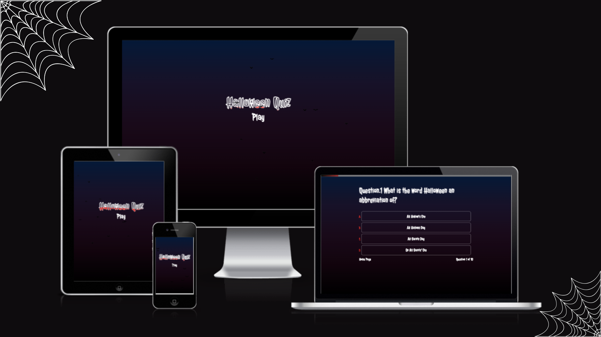
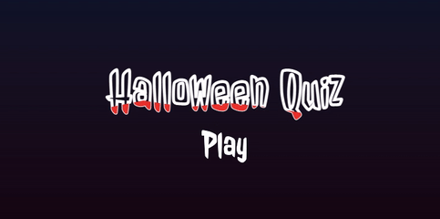
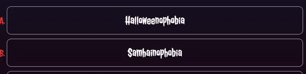

This **🎃 `Halloween` 🎃** trivia quiz will put your knowledge to the test. The quiz is intended to be enjoyable and entertaining. The quiz's features are simple to use and navigate. The rules of the quiz are simple: answer as many correct questions as possible before time runs out! 

 
#### To play **`Halloween Quiz`** click 🦇 [here](https://stanislavditsan.github.io/Halloween-Quiz/)

# Table of Content
- [User Experience](#user-experience)

  * [UX](#user-experience)

  * [Project Goal](#project-goal)

  * [User Objectives](#user-objectives)

- [Features](#features)

  * [The Home Page](#the-home-page)

  * [Quiz Page](#quiz-page)

- [Design](#design)

  * [Color Scheme](#color-Scheme)

  * [Typography](#typography)

- [Wireframes](#wireframes)

  * [Desktop](#desktop)

  * [Tablet](#tablet)

  * [Mobile](#mobile)

- [Languages Used](#languages-used)

- [Technologies Used and Tools](#technologies-used-and-tools)

- [Testing](#testing)

  * [Lighthouse](#lighthouse)

  * [Code Validation](#code-validation)

  * [Browser Compatibility](#browser-compatibility)

  * [Responsiveness](#responsiveness)

- [Bugs](#bugs)  

- [Deployment](#deployment) 

- [Credits](#credits)

  * [Content](#content)

  * [Acknowledgements](#acknowledgements)

  

 
# User Experience

## As a first time visitor I am able to: 

- View an alert message with instructions.

- See the difference between selecting the correct or incorrect answer with green for correct and red for incorrect.

- View the total number of questions before and after the answer was submitted.

- View the total score after the quiz was completed.

- The ability to check the answers after completing the quiz.

- The ability to return and restart the quiz.

- The option to go back to the home page.

- Access the app from any piece of technology such as smartphone, tablet, laptop or computer and be able to view all of the original content without any loss.

# Project Goal
-  Create the quiz to be as informative and user friendly.

- Allow the user to answer the quiz questions by selecting one of four answer options before the timer runs out.

- Be able to see the total score.

- Be able to see the total number of questions.

- Be able to see the correct answers after completing the quiz.

- Be able to provide instruction information to the user.

# User Objectives

- A website that provides an easy-to-understand quiz game.

- A website with visual interaction.

- A website with a modern design.

- A website that makes it simple to find and understand quiz controls.

- A website with which I can interact on a desktop, tablet, or mobile device.

# Features

## The home page 

- I wanted a simple homepage with a Halloween vibe, so I added the spooky font. 

- I used red to create a blood-like effect, and I used bats animation to give the page some movement. 

- I added a play button to allow users to jump right into the quiz, and I believe the homepage is simple to use.

- Plugin to display the bats animation was taken from [jQueryscript](https://www.jqueryscript.net/animation/halloween-bats-flying-around.html) 

## Quiz Page

The quiz page was created with a clean layout, well-placed buttons with hover effects, a lovely spooky typography, and a dark gradient background.

- An alert pop-up message appears at the start of the quiz, stating ` “Complete the quiz before the timer runs out. Keep an eye on the timer bar” `

- A timer bar appears at the top of the page.

- The Halloween quiz Page contains four different options for answering the questions.

- When you submit answer by simply clicking, you get a nice hover effect and a background of red and green.

- There is also a question counter and a home page button on the page.

 

- When the timer runs out, an alert pop-up message appears,
stating 
` “Time has run out! however, the quiz can still be completed” `

## Quiz page after answering all the questions 
 
- An alert pop-up message appears once all of the questions have been answered.
 “Congratulations, you have completed the quiz! Scroll down to see the results and answers”.

- You can see your overall score, review the answers, and return to the quiz by scrolling down once the quiz is completed .

# Design

- To achieve a Halloween vibe, I chose a spooky font. I used dark colors to tie the quiz into the Halloween theme, with red accents to represent blood.

## Why did I choose to do a Halloween quiz?

- As one of my favorite holidays, I decided to create a Halloween quiz. It is the only dark holiday of the year. It's a lot of fun to dress up and enjoy other people's outfits. 

- Decorating your home space, or yard is enjoyable. Everything is done for laughs. 

- This quiz is simply a fun extra activity to do with friends or family during Halloween. 

- In the future, I intend to increase the total number of questions.

